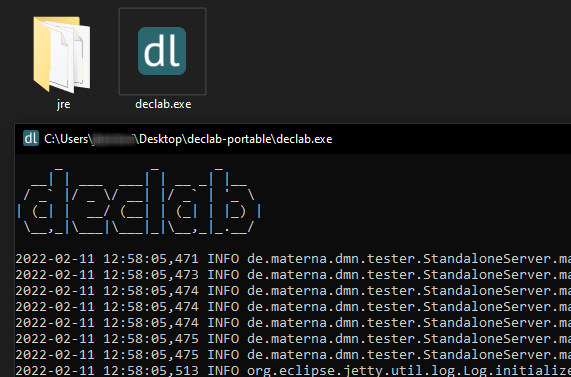

# Changelog
All notable changes to this project will be documented in this file.

## [Unreleased](https://github.com/materna-se/declab/compare/2.7.0...master) - 2022

Since the first version, declab has been developed exclusively for the application server JBoss and the open source distribution WildFly. With the release of declab 2.8.0, this will change. From now on, every version of declab will be released in two different variants.

The first variant for the application server JBoss and the open source distribution WildFly is of course still in focus and will receive all future updates. However, it will no longer be the variant on which all development until the release of a new version is performed.

The second variant, which will be released from now on as well, is named declab Portable and was created with the motivation to enable the uncomplicated use of declab even for experts who do not have an easy way to set up an application server. It runs entirely on the user's own computer. From now on, it will be the variant on which all development until the release of a new version is performed. The variant is released as a .zip archive together with the Java Runtime Engine in version 11. By double-clicking on the application, it opens as a console and displays the state of the application and any potential warnings that occur during use.



By default, the database and the created workspaces are stored in the user's home directory. For most users, the path to the directory will be `C:\Users\%username%\.declab`. To change the directory, a file named `declab.properties` can be placed next to the executable. The property `persistence.directory` can then be set to the path of the desired folder.

```properties
persistence.directory=C:\\Software\\.declab
```

### Added
- support for model challenges
- portable version

### Changed
- editor and import logic to improve performance

### Fixed
- web socket logic on long sessions
- 

<!--
### Removed
-->

### Updated
- Drools to version 7.62.0.Final
- multiple dependencies

## [2.7.0](https://github.com/materna-se/declab/compare/2.6.7...2.7.0) - 2021-11-24

### Added
- display of time since last import to the editor
- coloring of inputs and decisions to the builder
- support to copy a context into the playground

### Changed
- design of various components

### Fixed
- support for decision services
- web socket communication to remove accidental reloads of the editor

<!--
### Removed
-->

### Updated
- KIE editor to version 0.15.0
- server from Java 8 to Java 11
- Drools to version 7.61.0.Final
- multiple dependencies

## [2.6.7](https://github.com/materna-se/declab/compare/2.6.0...2.6.7) - 2021-09-30

### Added
- support for importing faulty models
- support for definiting the decision context
- keyboard navigation to various components to improve accessibility
- web socket notification if decision service is changed

### Changed
- header to display advanced workspace information

<!--
### Removed
-->

### Updated
- KIE editor to version 0.13.0
- Drools to version 7.59.0.Final
- multiple dependencies

## [2.6.0](https://github.com/materna-se/declab/compare/2.5.2...2.6.0) - 2021-08-04

### Added
- support for jDMN and Camunda execution engine
- importer feature to define test cases with Excel
- support for creating decision models
- integration of KIE editor

### Changed
- design of various components

### Updated
- Drools to version 7.53.1.Final
- multiple dependencies
