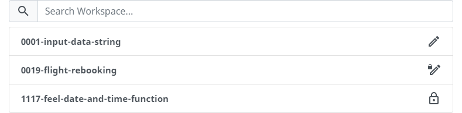

# Workspace
Workspaces are designed to enable collaborative work on decision models. For example, workspaces can be shared with other users to work together or to get feedback. As you'll see, declab's functions are always associated to a single workspace. This ensures that changes made by one user to his project do not affect other users and their projects.

## Accessing a Workspace
When declab is opened, a list of all existing workspaces is displayed.

For each workspace, its name, description and access mode is displayed. Since the list of existing workspaces can quickly become confusing, there is a search function at the top of the list that can be used to filter it. When the workspace you were looking for was found, you can enter it by clicking on its name.

## Creating a Workspace
When creating a workspace, several settings can be made. Some of them are required, others are optional.

The first two input fields are the name (*required*) and description (*optional*) of the workspace. They are displayed in the list of all existing workspaces and help to identify them. 
The third input field is the access mode (*required*) of the workspace. There are three different modes to choose from:

|Access Mode|Description|
|-|-|
|Public|Anonymous users can create, read, update and delete entities inside this workspace.|
|Protected|Anonymous users can read, authenticated users can also create, update and delete entities inside this workspace.|
|Private|Anonymous users can't enter the workspace, authenticated users can create, read, update and delete entities inside this workspace.|

The fourth input field is the password (*required if the access mode is set to protected or private, otherwise optional*) of the workspace. It allows the user to authenticate within the workspace to access entities that would otherwise be, based on the access mode of the workspace, not available to anonymous users.

## Editing a Workspace

All settings that were made during the creation of the workspace can be changed in the workspace settings. To do this, you first have to enter the workspace. Afterwards, there is a gear wheel on the right side of the navigation bar (<svg xmlns="http://www.w3.org/2000/svg" width="24" height="24" viewBox="0 0 24 24" style="display: inline"><path data-v-29e8c3c6="" d="M12 8a4 4 0 0 1 4 4 4 4 0 0 1-4 4 4 4 0 0 1-4-4 4 4 0 0 1 4-4m0 2a2 2 0 0 0-2 2 2 2 0 0 0 2 2 2 2 0 0 0 2-2 2 2 0 0 0-2-2m-2 12c-.25 0-.46-.18-.5-.42l-.37-2.65c-.63-.25-1.17-.59-1.69-.99l-2.49 1.01c-.22.08-.49 0-.61-.22l-2-3.46a.493.493 0 0 1 .12-.64l2.11-1.66L4.5 12l.07-1-2.11-1.63a.493.493 0 0 1-.12-.64l2-3.46c.12-.22.39-.31.61-.22l2.49 1c.52-.39 1.06-.73 1.69-.98l.37-2.65c.04-.24.25-.42.5-.42h4c.25 0 .46.18.5.42l.37 2.65c.63.25 1.17.59 1.69.98l2.49-1c.22-.09.49 0 .61.22l2 3.46c.13.22.07.49-.12.64L19.43 11l.07 1-.07 1 2.11 1.63c.19.15.25.42.12.64l-2 3.46c-.12.22-.39.31-.61.22l-2.49-1c-.52.39-1.06.73-1.69.98l-.37 2.65c-.04.24-.25.42-.5.42h-4m1.25-18l-.37 2.61c-1.2.25-2.26.89-3.03 1.78L5.44 7.35l-.75 1.3L6.8 10.2a5.55 5.55 0 0 0 0 3.6l-2.12 1.56.75 1.3 2.43-1.04c.77.88 1.82 1.52 3.01 1.76l.37 2.62h1.52l.37-2.61c1.19-.25 2.24-.89 3.01-1.77l2.43 1.04.75-1.3-2.12-1.55c.4-1.17.4-2.44 0-3.61l2.11-1.55-.75-1.3-2.41 1.04a5.42 5.42 0 0 0-3.03-1.77L12.75 4h-1.5z" fill="currentColor"></path></svg>) that will redirect you to the workspace settings.

For detailed information on the first four settings, please refer to the section [Creating a Workspace](?id=creating-a-workspace). The fifth input field allows you to enable the developer mode. The developer mode allows you to use features such as raw [JSON](https://www.json.org/json-en.html) in the builder. It is intended for developers and should be used with caution.

# Education

## Playground

## Challenger

# Execution

## Model

## Builder

## Publisher

## Discoverer