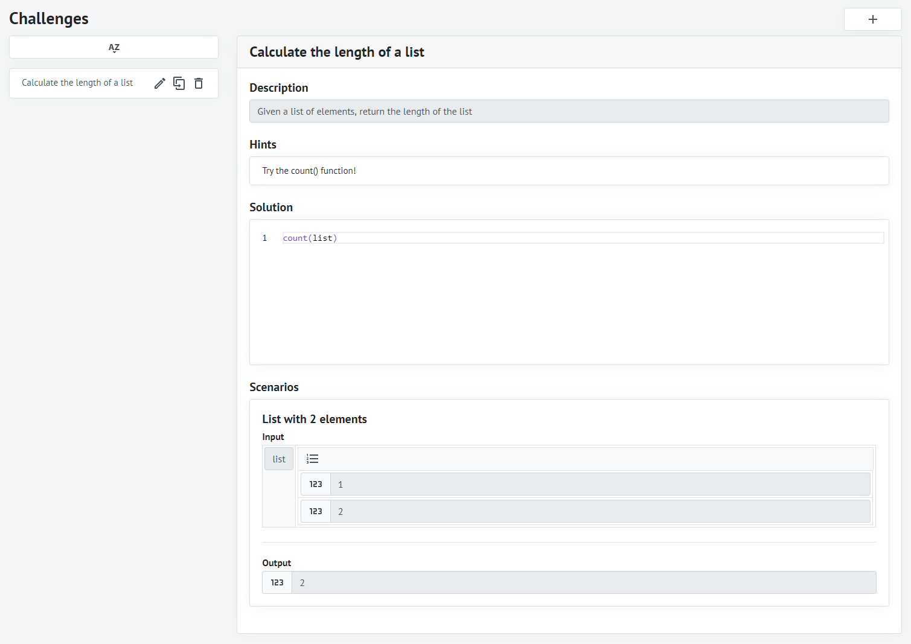
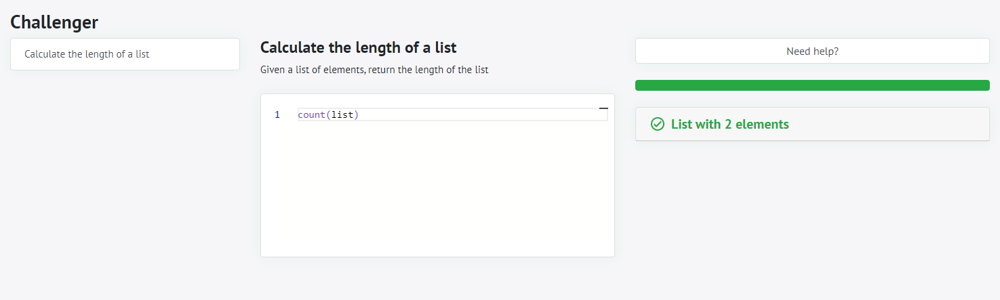

# Workspace
Workspaces are designed to enable collaborative work on decision models. For example, workspaces can be shared with other users to work together or to get feedback. As you'll see, declab's functions are always associated to a single workspace. This ensures that changes made by one user to his project do not affect other users and their projects.

## Viewing all Workspaces
When declab is opened, a list of all existing workspaces is displayed.

For each workspace, its name, description and access mode is displayed. Since the list of existing workspaces can quickly become confusing, there is a search function at the top of the list that can be used to filter it. When you have found the workspace you were looking for, you can enter it by clicking on its name.

## Creating a Workspace
When creating a workspace, several settings can be made. Some of them are required, others are optional.

The first two input fields are the name (*required*) and description (*optional*) of the workspace. They are displayed in the list of all existing workspaces and help to identify them. 
The third input field is the access mode (*required*) of the workspace. There are three different modes to choose from:

|Access Mode|Description|
|-|-|
|Public|Anonymous users can create, read, update and delete entities inside this workspace.|
|Protected|Anonymous users can read, authenticated users can also create, update and delete entities inside this workspace.|
|Private|Anonymous users can't enter the workspace, authenticated users can create, read, update and delete entities inside this workspace.|

The fourth input field is the password (*required if the access mode is set to protected or private, otherwise optional*) of the workspace. It allows the user to authenticate within the workspace to access entities that would otherwise be, based on the access mode of the workspace, not available to anonymous users.

## Editing a Workspace

All settings that were made during the creation of the workspace can be changed in the workspace settings. To do this, you first have to enter the workspace. Afterwards, there is a gear wheel on the right side of the navigation bar (<svg xmlns="http://www.w3.org/2000/svg" width="24" height="24" viewBox="0 0 24 24" style="display: inline"><path d="M12 8a4 4 0 0 1 4 4 4 4 0 0 1-4 4 4 4 0 0 1-4-4 4 4 0 0 1 4-4m0 2a2 2 0 0 0-2 2 2 2 0 0 0 2 2 2 2 0 0 0 2-2 2 2 0 0 0-2-2m-2 12c-.25 0-.46-.18-.5-.42l-.37-2.65c-.63-.25-1.17-.59-1.69-.99l-2.49 1.01c-.22.08-.49 0-.61-.22l-2-3.46a.493.493 0 0 1 .12-.64l2.11-1.66L4.5 12l.07-1-2.11-1.63a.493.493 0 0 1-.12-.64l2-3.46c.12-.22.39-.31.61-.22l2.49 1c.52-.39 1.06-.73 1.69-.98l.37-2.65c.04-.24.25-.42.5-.42h4c.25 0 .46.18.5.42l.37 2.65c.63.25 1.17.59 1.69.98l2.49-1c.22-.09.49 0 .61.22l2 3.46c.13.22.07.49-.12.64L19.43 11l.07 1-.07 1 2.11 1.63c.19.15.25.42.12.64l-2 3.46c-.12.22-.39.31-.61.22l-2.49-1c-.52.39-1.06.73-1.69.98l-.37 2.65c-.04.24-.25.42-.5.42h-4m1.25-18l-.37 2.61c-1.2.25-2.26.89-3.03 1.78L5.44 7.35l-.75 1.3L6.8 10.2a5.55 5.55 0 0 0 0 3.6l-2.12 1.56.75 1.3 2.43-1.04c.77.88 1.82 1.52 3.01 1.76l.37 2.62h1.52l.37-2.61c1.19-.25 2.24-.89 3.01-1.77l2.43 1.04.75-1.3-2.12-1.55c.4-1.17.4-2.44 0-3.61l2.11-1.55-.75-1.3-2.41 1.04a5.42 5.42 0 0 0-3.03-1.77L12.75 4h-1.5z" fill="currentColor"></path></svg>) that will redirect you to the workspace settings.

For detailed information on the first four settings, please refer to the section [Creating a Workspace](?id=creating-a-workspace). The fifth input field allows you to enable the developer mode. The developer mode allows you to use features such as raw [JSON](https://www.json.org/json-en.html) in the builder. It is intended for developers and should be used with caution.

## Deleting a Workspace

To delete a workspace, you first have to enter it. Afterwards, there is a gear wheel on the right side of the navigation bar (<svg xmlns="http://www.w3.org/2000/svg" width="24" height="24" viewBox="0 0 24 24" style="display: inline"><path d="M12 8a4 4 0 0 1 4 4 4 4 0 0 1-4 4 4 4 0 0 1-4-4 4 4 0 0 1 4-4m0 2a2 2 0 0 0-2 2 2 2 0 0 0 2 2 2 2 0 0 0 2-2 2 2 0 0 0-2-2m-2 12c-.25 0-.46-.18-.5-.42l-.37-2.65c-.63-.25-1.17-.59-1.69-.99l-2.49 1.01c-.22.08-.49 0-.61-.22l-2-3.46a.493.493 0 0 1 .12-.64l2.11-1.66L4.5 12l.07-1-2.11-1.63a.493.493 0 0 1-.12-.64l2-3.46c.12-.22.39-.31.61-.22l2.49 1c.52-.39 1.06-.73 1.69-.98l.37-2.65c.04-.24.25-.42.5-.42h4c.25 0 .46.18.5.42l.37 2.65c.63.25 1.17.59 1.69.98l2.49-1c.22-.09.49 0 .61.22l2 3.46c.13.22.07.49-.12.64L19.43 11l.07 1-.07 1 2.11 1.63c.19.15.25.42.12.64l-2 3.46c-.12.22-.39.31-.61.22l-2.49-1c-.52.39-1.06.73-1.69.98l-.37 2.65c-.04.24-.25.42-.5.42h-4m1.25-18l-.37 2.61c-1.2.25-2.26.89-3.03 1.78L5.44 7.35l-.75 1.3L6.8 10.2a5.55 5.55 0 0 0 0 3.6l-2.12 1.56.75 1.3 2.43-1.04c.77.88 1.82 1.52 3.01 1.76l.37 2.62h1.52l.37-2.61c1.19-.25 2.24-.89 3.01-1.77l2.43 1.04.75-1.3-2.12-1.55c.4-1.17.4-2.44 0-3.61l2.11-1.55-.75-1.3-2.41 1.04a5.42 5.42 0 0 0-3.03-1.77L12.75 4h-1.5z" fill="currentColor"></path></svg>) that will redirect you to the workspace settings. On the right side of the workspace settings, you will find a card titled `Deletion`. By clicking on the button titled `Delete` inside the card, the workspace will be deleted and you will be redirected to the list of all existing workspaces. **Please note that the deletion of workspaces is permanent and cannot be undone.**

# Education

## Playground

The playground page provides users with the means to discover FEEL at their own pace. Users can create elaborate input structures and experiment with the way FEEL expressions operate on the data. This gives users the opportunity to test FEEL expressions for Business Knowledge Models and Decisions in real DMN applications.

To get started, navigate to the playground page under `Education 🡒 Playground`. You will be met with a FEEL editor, a context editor and an output column. The context can provide information to the FEEL expression, which will create the displayed output. 

Users can also save and load their playgrounds. To save a playground, simply enter a name (*required*) and a description (*optional*) under the Playground section, then click on the save icon (<svg xmlns="http://www.w3.org/2000/svg" width="24" height="24" viewBox="0 0 24 24" style="display: inline"><path d="M15,9H5V5H15M12,19A3,3 0 0,1 9,16A3,3 0 0,1 12,13A3,3 0 0,1 15,16A3,3 0 0,1 12,19M17,3H5C3.89,3 3,3.9 3,5V19A2,2 0 0,0 5,21H19A2,2 0 0,0 21,19V7L17,3Z" fill="currentColor"></path></svg>). To load a playground, select the desired option from the "Playground" dropdown menu. If you wish to clone a playground, simply load it, make your changes and click on the clone icon (<svg xmlns="http://www.w3.org/2000/svg" width="24" height="24" viewBox="0 0 24 24" style="display: inline"><path d="M11 17H4a2 2 0 0 1-2-2V3a2 2 0 0 1 2-2h12v2H4v12h7v-2l4 3-4 3v-2m8 4V7H8v6H6V7a2 2 0 0 1 2-2h11a2 2 0 0 1 2 2v14a2 2 0 0 1-2 2H8a2 2 0 0 1-2-2v-2h2v2h11z" fill="currentColor"></path></svg>). This will allow you to save the playground under a new, different path.

## Challenger

The challenger page is a place for users to practice their FEEL (Friendly Enough Expression Language) skills in small programming challenges. These challenges can be created by other users within the same workspace using the challenge editor page. As such, these two pages go hand in hand.

Every challenge has a name (*required*), a description (*optional*), a list of hints (*optional*), a list of test cases (*required*) and a solution (*required*). Users can test their own FEEL solutions against the list of test cases, view hints if they are given and compare their solutions to that provided by the challenge creator. This gives users the ability to create interactive FEEL programming classes. The knowledge gained from this can be applied in DMN development.

To create a challenge, you must first enter a workspace. Next, navigate to `Design 🡒 Challenges` in the navigation bar. Click the + button in the top right to create a new challenge. This will provide you with a form where you can enter the name and description, create an optional list of hints, specify a solution and create a list of test cases. Each test case consists of an input and an output, and the FEEL code that users provide must convert the given input to the given output. If all test cases are successful, the user has passed the challenge.

# Execution

## Model

The model page is designed to provide an overview of all models and their entities within the workspace. In addition, the page can also be used to manage them: You can import new models, change the order of the imported models and delete imported, but no longer required models.

When you enter a workspace, you will be redirected to the model page. Alternatively, if you are already inside the workspace, you can access the model page from the navigation bar by selecting `Execution 🡒 Model`.

### Viewing all Models

To illustrate declab's functions in the next sections, we'll use the decision models from the test case `0086-import` of the [Decision Model and Notation Technology Compatibility Kit](https://dmn-tck.github.io/tck). The test case consists of two .dmn files. The first .dmn file is `Imported_Model.dmn` that contains a business knowledge model named `Say Hello`. The second .dmn file is `0086-import.dmn` that contains an input named `A Person` and a decision named `A Decision Ctx with DT` that will reference the business knowledge model named `Say Hello` from the first .dmn file to return a greeting based on the input.

### Importing a Model
To import the decision models into declab, they can be dragged and dropped onto the <svg xmlns="http://www.w3.org/2000/svg" width="24" height="24" viewBox="0 0 24 24" style="display: inline"><path d="M19 13h-6v6h-2v-6H5v-2h6V5h2v6h6v2z" fill="currentColor"></path></svg> icon. **Please note that the order of importing is important.** Since the second .dmn file references the first .dmn file, the first .dmn file must be uploaded first, otherwise, the reference of the second .dmn file cannot be resolved.

If the decision models could be imported successfully, some information about the entities inside the model is displayed.  

If messages occurred during the import of the decision models, detailed information about the underlying cause is displayed. If, for example, the order of importing is not respected by importing the second .dmn file before the first one, an error will be displayed.

There are currently three types of messages that can be returned during the import:

|Message Type|Description|
|:-:|-|
|<svg xmlns="http://www.w3.org/2000/svg" width="24" height="24" viewBox="0 0 24 24" style="display: inline"><path d="M11 9h2V7h-2m1 13c-4.41 0-8-3.59-8-8s3.59-8 8-8 8 3.59 8 8-3.59 8-8 8m0-18A10 10 0 002 12a10 10 0 0010 10 10 10 0 0010-10A10 10 0 0012 2m-1 15h2v-6h-2v6z" fill="#2196f3"></path></svg>|Indicates that the message is only an information to help the user to understand what happened during the import.|
|<svg xmlns="http://www.w3.org/2000/svg" width="24" height="24" viewBox="0 0 24 24" style="display: inline"><path d="M12 2L1 21h22M12 6l7.53 13H4.47M11 10v4h2v-4m-2 6v2h2v-2" fill="#ff9800"></path></svg>|Indicates that the message is a warning that can potentially lead to unexpected behavior but does not prevent the import.|
|<svg xmlns="http://www.w3.org/2000/svg" width="24" height="24" viewBox="0 0 24 24" style="display: inline"><path d="M11 15h2v2h-2v-2m0-8h2v6h-2V7m1-5C6.47 2 2 6.5 2 12a10 10 0 0010 10 10 10 0 0010-10A10 10 0 0012 2m0 18a8 8 0 01-8-8 8 8 0 018-8 8 8 0 018 8 8 8 0 01-8 8z" fill="#f44336"></path></svg>|Indicates that the message is an error that prevents the import. It must be corrected by the user.|

## Builder

## Publisher

## Discoverer